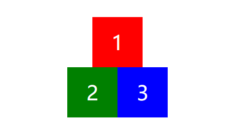

# 5.1 品字布局

## 第一种：非全屏

```html
<!DOCTYPE html>
<html>
  <head>
    <meta charset="utf-8" />
    <title>品字布局</title>
    <style>
      * {
        margin: 0;
        padding: 0;
      }
      body {
        overflow: hidden;
      }
      div {
        margin: auto 0;
        width: 100px;
        height: 100px;
        background: red;
        font-size: 40px;
        line-height: 100px;
        color: #fff;
        text-align: center;
      }

      .div1 {
        margin: 100px auto 0;
      }

      .div2 {
        margin-left: 50%;
        background: green;
        float: left;
        transform: translateX(-100%);
      }

      .div3 {
        background: blue;
        float: left;
        transform: translateX(-100%);
      }
    </style>
  </head>

  <body>
    <div class="div1">1</div>
    <div class="div2">2</div>
    <div class="div3">3</div>
  </body>
</html>
```

效果如下：



## 第二种：全屏

```html
<!DOCTYPE html>
<html>
  <head>
    <meta charset="utf-8" />
    <title>品字布局</title>
    <style>
      * {
        margin: 0;
        padding: 0;
      }

      div {
        width: 100%;
        height: 100px;
        background: red;
        font-size: 40px;
        line-height: 100px;
        color: #fff;
        text-align: center;
      }

      .div1 {
        margin: 0 auto 0;
      }

      .div2 {
        background: green;
        float: left;
        width: 50%;
      }

      .div3 {
        background: blue;
        float: left;
        width: 50%;
      }
    </style>
  </head>

  <body>
    <div class="div1">1</div>
    <div class="div2">2</div>
    <div class="div3">3</div>
  </body>
</html>
```

效果如下：


