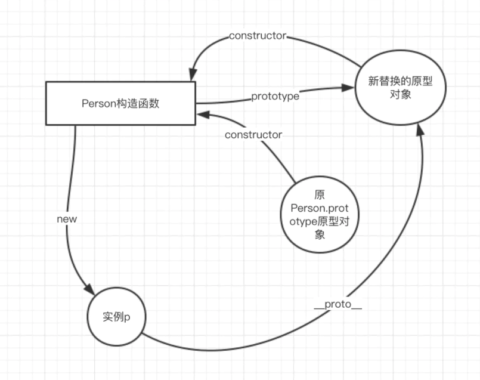
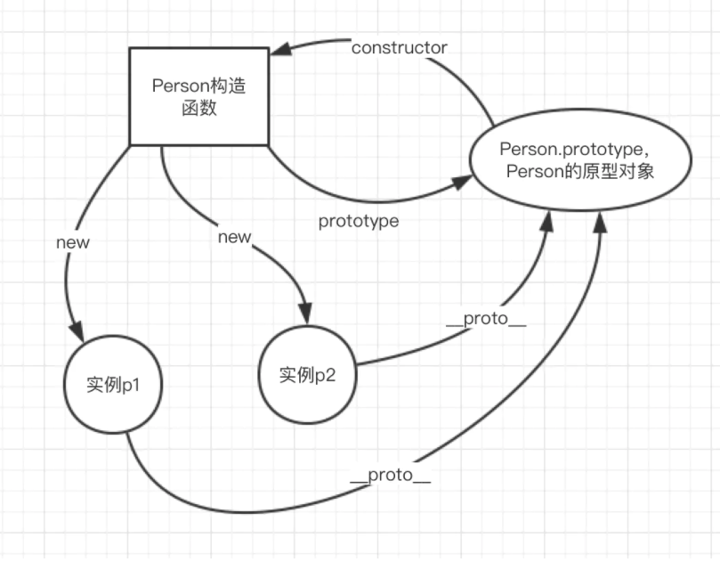
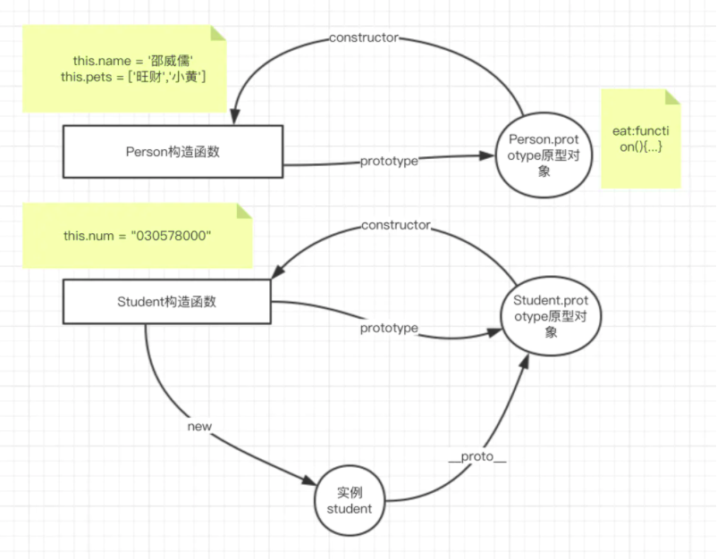
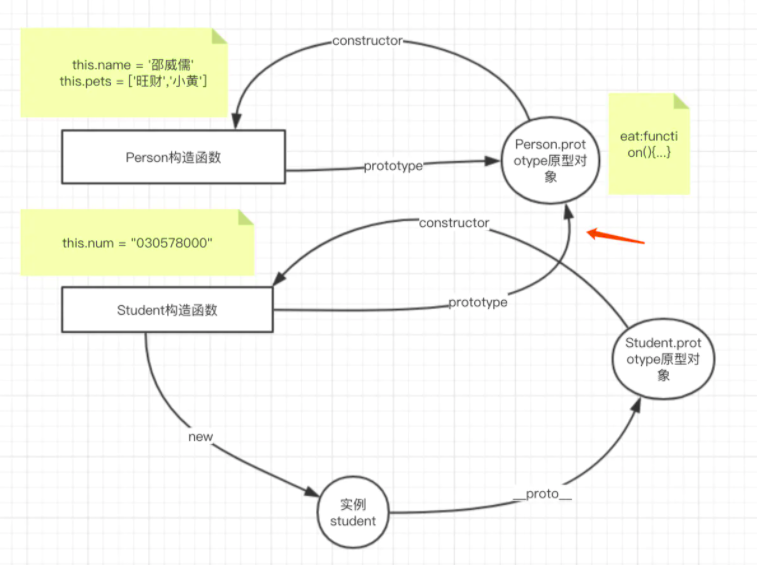
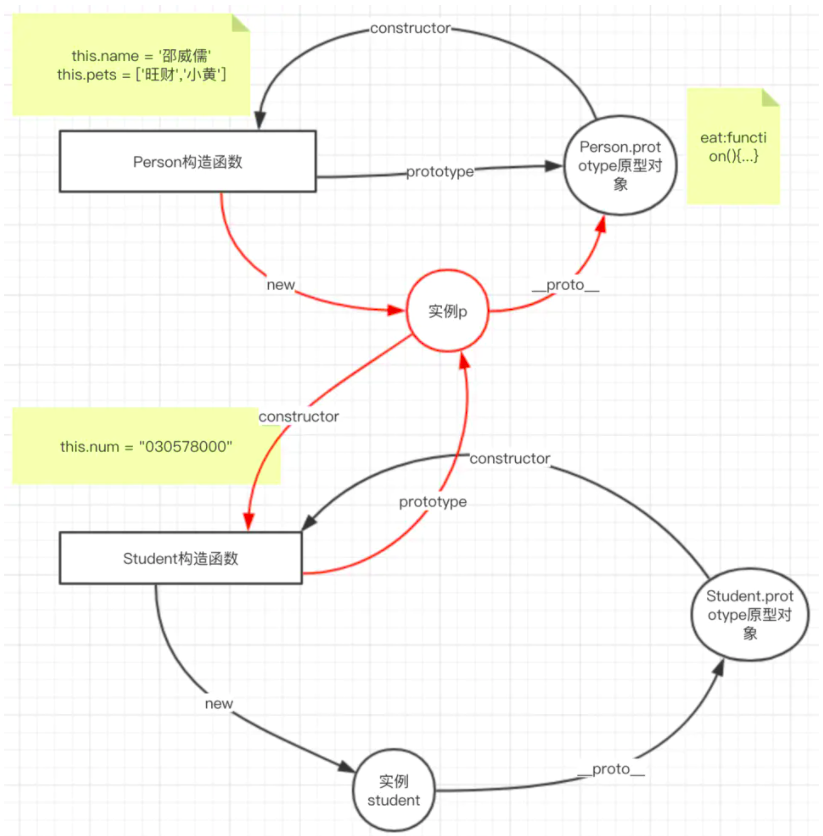
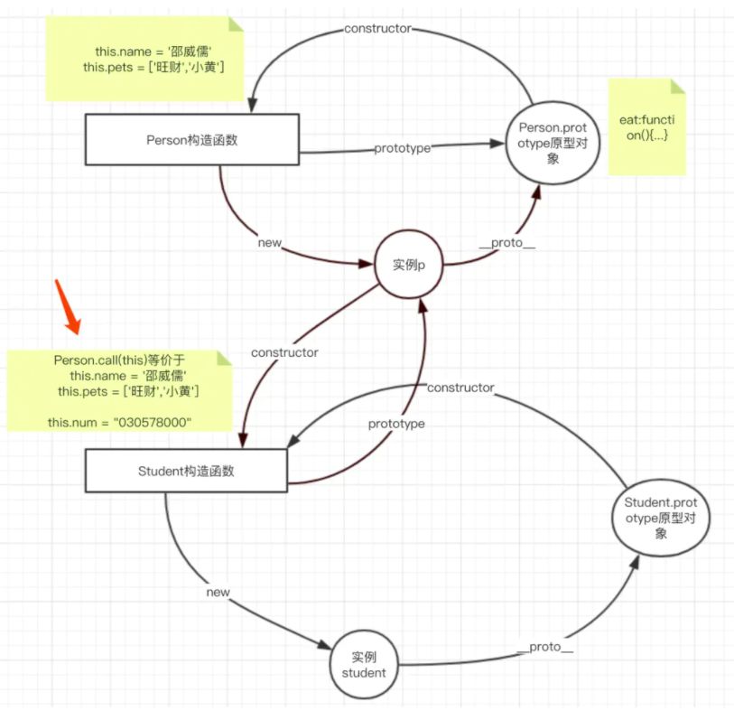
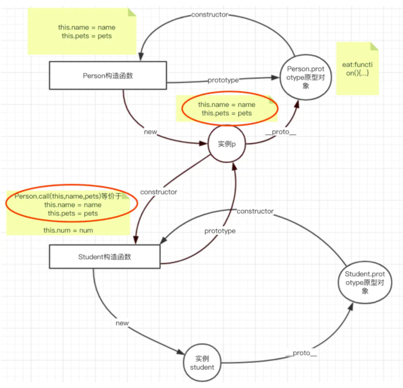
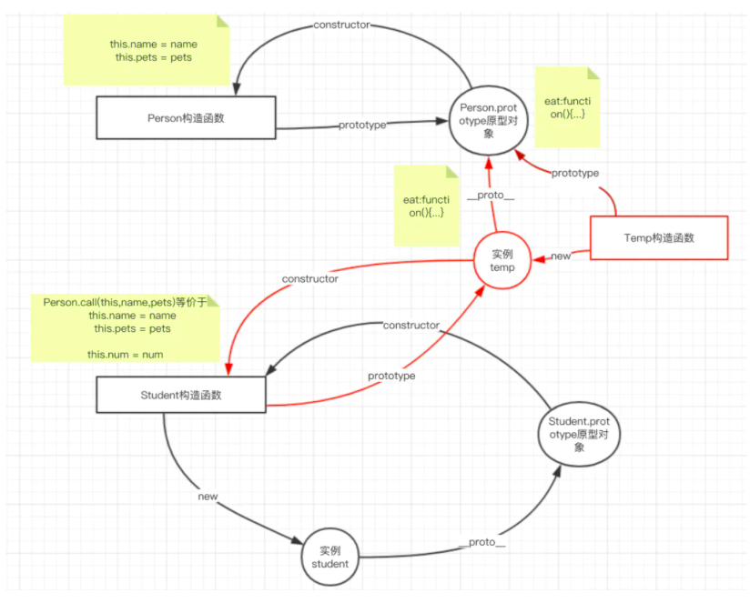

# 面向对象

## 面向对象的好处

好处：

1. 更方便
2. 复用性好
3. 高内聚低耦合
4. 代码冗余度低

特性：

1. 封装
2. 继承
3. 多态

### 1. 封装

```js
// 假设需要登记学籍，分别记录小明和小红的学籍号、姓名
let name1 = '小明'
let num1 = '040301'
let name2 = '小红'
let num2 = '040302'

//如果需要登记大量的数据，弊端会非常明显，且不好维护，那么我们就是用下面👇的方法来登记，这也是面向对象的特性之一：封装
let p1 = {
  name: '小明',
  num: '040301'
}
let p2 = {
  name: '小红',
  num: '040302'
}
```

### 2. 继承

```js
// 从已有的对象上，获取属性、方法
function Person() {
  this.name = 'wuyi'
}

Person.prototype.eat = function() {
  console.log('吃饭')
}
let p1 = new Person()
p1.eat() // 吃饭

let p2 = new Person()
p2.eat()// 吃饭
```

### 3. 多态

```js
// 同一操作，针对不同对象，会有不同的结果
let arr = [1,2,3]
arr.toString() //1,2,3

let obj = new Object()
obj.toString() //[object Object]
```

## 如何创建对象

1. 对象字面量
2. 利用内置对象 new Object()
3. 利用构造函数

### 1. 字面量

> 该方式的劣势比较明显，就是无法复用，如果创建大量同类型的对象，则代码会非常冗余

```js
let person = {
  name: 'wuyi',
  age: 24,
  eat: function() {
    console.log('吃放')
  }
}
```

### 2. 利用内置对象的方式创建对象

> 该方式的劣势也比较明显，就是没办法判断类型

```js
function createObj(name, age) {
  let obj = new Object()
  obj.name = name
  obj.age = age
  return obj
}
let p1 = createObj('小明'，12)
let p2 = createObj('小红', 11)

console.log(p1 === p2) //false
console.log(p1.constructor) //Object 指向的构造函数是Object
console.log(p2.constructor) //Object 指向的构造函数是Object

// 那么为什么说没办法判断类型呢？那么我们创建一条狗的对象
// 可以看出，狗的constructor也是指向Object，那么我们人和狗的类型就没办法去区分了
let dog = createObj('旺财'， 2)
console.log(dog.constructor) //Object 指向的构造函数是Object
```

### 3. 利用构造函数的方式创建对象

执行的过程:

1. 使用new这个关键词来创建对象
2. 在构造函数内部把新创建出来的对象赋予给this
3. 在构造函数内部把新创建（将来new的对象）的属性方法绑到this上
4. 默认是返回新创建的对象，特别需要注意的是

```js
function Person(name, age) {
  // 1.系统自动创建对象，并且把这个对象赋值到this上，此步不需要我们操作
  // let this = new Object()

  // 2.给这个对象赋属性、方法，需要我们自己操作
  this.name = name
  this.age = age
  this.eat = function () {
    console.log(name + '吃饭')
  }
  // 3.系统自动返回创建的对象
  // return this
}
let p3 = new Person('wuyi', 24);
console.log(p3.constructor) //Person 指向的构造函数是Person

function Dog(name,age){
    this.name = name
    this.age = age
}

let dog1 = new Dog("旺财",10)
console.log(dog1.constructor) // Dog 指向的构造函数是Dog
```

默认是返回新创建的对象，特性需要注意的是:

> 如果显式return一个对象数据类型，那么将来new的对象，就是显式return的对象

栗子🌰：

```js
// 当我们显式return一个原始数据类型
function Person(name, age) {
  this.name = name
  this.age = age
  return "1"
}
let p = new Person('wuyi', 24); //{name:'wuyi', age:24}
```

```js
// 当我们显式return一个对象数据类型时
function Person(name,age){
  this.name = name
  this.age = age
  return [1,2,3]
}
let p = new Person("wuyi",24) // [ 1, 2, 3 ]
// 我们发现，当显式return一个对象数据类型时，我们new出来的对象，得到的是return的值
```

## 实例属性方法、静态属性方法、原型属性方法

### 实例属性方法

```js
function Person(name,age){
  // 实例属性
  this.name = name
  this.age = age
  // 实例方法
  this.eat =function() {
    console.log(this.name + '吃饭')
  }
}
/// 通过构造函数创建出实例p
let p = new Person("wuyi",24)
// 通过实例p去访问实例属性
console.log(p.name) // wuyi
// 通过实例p去访问实例方法
p.eat() // wuyi吃饭
```

### 静态属性方法

绑定在构造函数上的属性方法，需要通过构造函数访问

```js
// 比如我们想取出这个Person构造函数创建了多少个实例
function Person(name, age) {
  this.name = name
  this.age = age
  if (!Person.total) {
    Person.total = 0
  }
  Person.total++
}

let p1 = new Person('小明',12)
console.log(Person.total) // 1
let p2 = new Person('小红',11)
console.log(Person.total) // 2
```

### 原型属性方法

构造函数`new`出来的实例，都共享这个构造函数的原型对象上的属性方法，类似共享库。

```js
function Person(name,age){
  this.name = name
  this.age = age
}

Person.prototype.eat = function(){ // 使用prototype找到该Person的原型对象
  console.log(this.name + '吃饭')
}

let p1 = new Person("小明",12)
let p2 = new Person("小红",11)
console.log(p1.eat === p2.eat) // true
p1.eat() // 小明吃饭
```

## 我们为什么需要原型对象（共享库）？

因为通过new生成的实例，相当于是重新开辟了一个堆区，虽然是同类型，拥有类似的属性和方法，但是这些属性和方法，并不是相同的

```js
function Person(name,age){
  this.name = name
  this.age = age
  this.eat = function(){
    console.log('吃饭')
  }
}

let p1 = new Person("xiaoming",12)
let p2 = new Person("xiaohong",11)

console.log(p1.eat === p2.eat) // false
```

从上面可以得出，`p1`和`p2`的`eat`方法，行为是一致的，但是他们却不等，是因为他们不同在一个堆区，如果只有1、2个实例还好，如果大量的实例，那么会大量生成这种原本可以复用共用的属性方法，非常耗费性能，不利于复用。

此时我们就需要一个类似共享库的对象，让实例能够沿着原型链，去找。

```js
function Person(name){
  this.name = name
}

Person.prototype.eat = function(){ // 通过构造函数Person的prototype属性找到Person的原型对象
  console.log('吃饭')
}

let p1 = new Person("xiaoming",12)
let p2 = new Person("xiaohong",11)

console.log(p1.eat === p2.eat) // true
```

这样可以增加复用性，但是还存在一个问题，如果我们要给原型对象添加大量属性方法时，我们不断的`Person.prototype.xxx = xxx、Person.prototype.xxxx = xxxx`，这样也是很繁琐，那么我们该怎么解决这个问题？

```js
function Person(name){
  this.name = name
}
// 让Person.prototype指针指向一个新的对象
Person.prototype = {
  eat:function(){
    console.log('吃饭')
  },
  sleep:function(){
    console.log('睡觉')
  }
}
```



### 如何找到原型对象

```js
function Person(name){
  this.name = name
}

Person.prototype = {
  eat:function(){
    console.log('吃饭')
  },
  sleep:function(){
    console.log('睡觉')
  }
}

let p = new Person('邵威儒',28)
// 访问原型对象
console.log(Person.prototype)
console.log(p.__proto__) // __proto__仅用于测试，不能写在正式代码中
```

### 和原型对象有关几个常用方法

#### hasOwnProperty 在对象自身查找属性而不到原型上查找

```js
function Person(){
  this.name = '邵威儒'
}

let p = new Person()

let key = 'name'
if((key in p) && p.hasOwnProperty(key)){
  // name仅在p对象中
}
```

#### isPrototypeOf 判断一个对象是否是某个实例的原型对象

```js
function Person(){
  this.name = '邵威儒'
}

let p = new Person()

let obj = Person.prototype
obj.isPrototypeOf(p) // true
```

### 更改原型对象constructor指针

原型对象默认是有一个指针constructor指向其构造函数的，

如果我们把构造函数的原型对象，替换成另外一个原型对象，那么这个新的原型

对象的constructor则不是指向该构造函数，会导致类型判断的错误

```js
function Person(){
  this.name = '邵威儒'
}

Person.prototype = { // 把Person构造函数的原型对象替换成该对象
  eat:function(){
    console.log('吃饭')
  }
}

console.log(Person.prototype.constructor) // Object

// 我们发现，该原型对象的constructor指向的是Object而不是Person
// 那么我们现在解决一下这个问题，把原型对象的constructor指向到Person
Person.prototype.constructor = Person
console.log(Person.prototype.constructor) // Person
```

### 构造函数、原型对象、实例之间的关系



## 继承

面向对象的继承方式有很多种，原型链继承、借用构造函数继承、组合继承、原型式继承、寄生式继承、寄生式组合继承、深拷贝继承等等。

### 原型链继承

利用原型链的特性，当在自身找不到时，会沿着原型链往上找。

```js
function Person(){
  this.name = '邵威儒'
  this.pets = ['旺财','小黄']
}

Person.prototype.eat = function(){
  console.log('吃饭')
}

function Student(){
  this.num = "030578000"
}
let student = new Student()

console.log(student.num) // '030578000'
console.log(student.name) // undefined
console.log(student.pets) // undefined
student.eat() // 报错
```

从上面我们可以看到，`Student`没有继承`Person`，此时它们之间的联系是这样的。



既然要让实例`student`访问到`Person`的原型对象属性方法，

我们会想到，把`Student.prototype`改写为`Person.prototype`

```js
function Person(){
  this.name = '邵威儒'
  this.pets = ['旺财','小黄']
}

Person.prototype.eat = function(){
  console.log('吃饭')
}

function Student(){
  this.num = "030578000"
}

// 改写Student.prototype指针指向
Student.prototype = Person.prototype
let student = new Student()

console.log(student.num)
// '030578000'
console.log(student.name)
// undefined
console.log(student.pets)
// undefined
student.eat()
// '吃饭'
```

此时关系图为



现在修改了`Student.prototype`指针指向为`Person.prototype`后，可以访问`Person.prototype`上的`eat`方法，但是`student`还不能继承`Person.name`和`Person.pets`，那我会想到，是`Person`的实例，才会同时拥有实例属性方法和原型属性方法。

```js
function Person(){
  this.name = '邵威儒'
  this.pets = ['旺财','小黄']
}

Person.prototype.eat = function(){
  console.log('吃饭')
}

function Student(){
  this.num = "030578000"
}

// new一个Person的实例，同时拥有其实例属性方法和原型属性方法
let p = new Person()

// 把Student的原型对象指向实例p
Student.prototype = p

// 把Student的原型对象的constructor指向Student，解决类型判断问题
Student.prototype.constructor = Student
let student = new Student()

console.log(student.num)
// '030578000'
console.log(student.name)
// '邵威儒'
console.log(student.pets)
// '[ '旺财', '小黄' ]'
student.eat()
// '吃饭'
```

因为实例p是由Person构造函数实例化出来的，所以同时拥有其实例属性方法和原型属性方法，并且把这个实例p作为Student的原型对象，此时的关系图如下



### 借助构造函数继承

通过这样的方式，会有一个问题，原型对象类似一个共享库，所有实例共享原型对象同一个属性方法，如果原型对象上有引用类型，那么会被所有实例共享，也就是某个实例更改了，则会影响其他实例，我们可以看一下

```js
function Person(){
  this.name = '邵威儒'
  this.pets = ['旺财','小黄']
}

Person.prototype.eat = function(){
  console.log('吃饭')
}

function Student(){
  this.num = "030578000"
}

let p = new Person()
Student.prototype = p
Student.prototype.constructor = Student

let student = new Student()
let student2 = new Student() // new多一个实例

console.log(student.num)
// '030578000'
console.log(student.name)
// '邵威儒'
console.log(student.pets)
// '[ '旺财', '小黄' ]'
student.eat()
// '吃饭'

// 此时我们修改某一个实例，pets是原型对象上的引用类型 数组
student.pets.push('小红')

console.log(student.pets)
// [ '旺财', '小黄', '小红' ]
console.log(student2.pets)
// [ '旺财', '小黄', '小红' ]
```

从上面可以看出，student的pets（实际就是原型对象上的pets）被修改后，相关的实例student2也会受到影响。

那么我们能不能把Person上的属性方法，添加到Student上呢？以防都存在原型对象上，会被所有实例共享，特别是引用类型的修改，会影响所有相关实例。

可以利用call来实现。

```js
function Person(){
  this.name = '邵威儒'
  this.pets = ['旺财','小黄']
}

Person.prototype.eat = function(){
  console.log('吃饭')
}

function Student(){
  // 利用call调用Person上的属性方法拷贝一份到Student
  Person.call(this)  
  this.num = "030578000"
}

let p = new Person()
Student.prototype = p
Student.prototype.constructor = Student

let student = new Student()
let student2 = new Student()

console.log(student.num)
// '030578000'
console.log(student.name)
// '邵威儒'
console.log(student.pets)
// '[ '旺财', '小黄' ]'
student.eat()
// '吃饭'

// 此时我们修改某一个实例，pets是原型对象上的引用类型 数组
student.pets.push('小红')

console.log(student.pets)
// [ '旺财', '小黄', '小红' ]
console.log(student2.pets)
// [ '旺财', '小黄' ]
```

上面在子构造函数（Student）中利用**call调用父构造函数**（Person）的方式，叫做**借助构造函数继承**

结合上面所看，**使用了原型链继承和借助构造函数继承，两者结合起来使用叫组合继承**，关系图如下：



那么还有个问题，当父构造函数需要接收参数时，怎么处理？

```js
function Person(name,pets){ // 父构造函数接收name，pets参数
  this.name = name // 赋值到this上
  this.pets = pets // 赋值到this上
}

Person.prototype.eat = function(){
  console.log('吃饭')
}

function Student(num,name,pets){ // 在子构造函数中也接收参数
  Person.call(this,name,pets) // 在这里把name和pets传参数
  this.num = num // 赋值到this上
}

let p = new Person()
Student.prototype = p
Student.prototype.constructor = Student

let student = new Student("030578000","邵威儒",["旺财","小黄"])
let student2 = new Student("030578001","wuyi",["小红"])

console.log(student.num)
// '030578000'
console.log(student.name)
// '邵威儒'
console.log(student.pets)
// '[ '旺财', '小黄' ]'
student.eat()
// '吃饭'

student.pets.push('小红')

console.log(student.pets)
// [ '旺财', '小黄', '小红' ]
console.log(student2.pets)
// [ '小红' ]
```



这样我们就可以在子构造函数中给父构造函数传参了，而且我们也发现上图中，2个红圈的地方，代码是重复了，那么接下来我们怎么解决呢？

能否在子构造函数设置原型对象的时候，只要父构造函数的原型对象属性方法呢？

当然是可以的，接下来我们讲寄生式组合继承，也是目前程序猿认为解决继承问题最好的方案。

### 寄生式组合继承

```js
function Person(name,pets){
  this.name = name
  this.pets = pets
}

Person.prototype.eat = function(){
  console.log('吃饭')
}

function Student(num,name,pets){
  Person.call(this,name,pets)
  this.num = num
}

// 寄生式继承
// 声明一个空的构造函数，用于桥梁作用
function Temp(){}

// 把Temp构造函数的原型对象指向Person的原型对象
Temp.prototype = Person.prototype

// 用构造函数Temp实例化一个实例temp
let temp = new Temp()

// 把子构造函数的原型对象指向temp
Student.prototype = temp

// 把temp的constructor指向Student
temp.constructor = Student

let student1 = new Student('030578001','邵威儒',['旺财','小黄'])
console.log(student1)
// Student { name: '邵威儒', pets: [ '旺财', '小黄' ], num: '030578001' }

let student2 = new Student('030578002','wuyi',['小红'])
console.log(student2)
// Student { name: 'wuyi', pets: [ '小红' ], num: '030578002' }
```

至此为止，我们就完成了寄生式组合继承了，主要逻辑就是用一个空的构造函数，来当做桥梁，并且把其原型对象指向父构造函数的原型对象，并且实例化一个`temp`，`temp`会沿着这个原型链，去找到父构造函数的原型对象



#### 原型式继承

```js
// 原型式继承
function createObjWithObj(obj){ // 传入一个原型对象
  function Temp(){}
  Temp.prototype = obj
  let o = new Temp()
  return o
}

// 把Person的原型对象当做temp的原型对象
let temp = createObjWithObj(Person.prototype)

// 也可以使用Object.create实现
// 把Person的原型对象当做temp2的原型对象
let temp2 = Object.create(Person.prototype)
```

#### 寄生式继承

```js
// 寄生式继承
// 我们在原型式的基础上，希望给这个对象新增一些属性方法
// 那么我们在原型式的基础上扩展
function createNewObjWithObj(obj) {
  let o = createObjWithObj(obj)
  o.name = "邵威儒"
  o.age = 28
  return o
}
```

## 深拷贝继承

### 方法一 利用 `JSON.stringify` 和 `JSON.parse`

```js
let swr = {
  name:"邵威儒",
  age:28
}
let swrCopy = JSON.parse(JSON.stringify(swr))

console.log(swrCopy)
// { name:"邵威儒",age:28 }

// 此时我们修改swr的属性
swr.age = 29
console.log(swr)
// { name:"邵威儒",age:29 }

// 但是swrCopy却不会受swr影响
console.log(swrCopy)
// { name:"邵威儒",age:28 }
```

这种方式进行深拷贝，只针对`json`数据这样的键值对有效。

对于函数等等反而无效，不好用，接着继续看方法二、三。

### 方法二

```js
// 方法二：
function deepCopy(fromObj,toObj) { // 深拷贝函数
  // 容错
  if(fromObj === null) return null // 当fromObj为null
  if(fromObj instanceof RegExp) return new RegExp(fromObj) // 当fromObj为正则
  if(fromObj instanceof Date) return new Date(fromObj) // 当fromObj为Date

  toObj = toObj || {}
  
  for(let key in fromObj){ // 遍历
    if(typeof fromObj[key] !== 'object'){ // 是否为对象
      toObj[key] = fromObj[key] // 如果为原始数据类型，则直接赋值
    }else{
      toObj[key] = new fromObj[key].constructor // 如果为object，则new这个object指向的构造函数
      deepCopy(fromObj[key],toObj[key]) // 递归
    }
  }
  
  return toObj
}

let dog = {
  name:"小白",
  sex:"公",
  friends:[
    {
      name:"小黄",
      sex:"母"
    }
  ]
}

let dogCopy = deepCopy(dog)
// 此时我们把dog的属性进行修改
dog.friends[0].sex = '公'

console.log(dog)
// { name: '小白', sex: '公', friends: [ { name: '小黄', sex: '公' } ] }

// 当我们打印dogCopy，会发现dogCopy不会受dog的影响
console.log(dogCopy)
// { name: '小白', sex: '公', friends: [ { name: '小黄', sex: '母' } ] }
```

### 方法三

```js
// 方法三：
let dog = {
  name:"小白",
  sex:"公",
  friends:[
    {
      name:"小黄",
      sex:"母"
    }
  ]
}

function deepCopy(obj) {
  if(obj === null) return null
  if(typeof obj !== 'object') return obj
  if(obj instanceof RegExp) return new RegExp(obj)
  if(obj instanceof Date) return new Date(obj)

  let newObj = new obj.constructor
  for(let key in obj){
    newObj[key] = deepCopy(obj[key])
  }

  return newObj
}

let dogCopy = deepCopy(dog)
dog.friends[0].sex = '公'

console.log(dogCopy)
// { name: '小白', sex: '公', friends: [ { name: '小黄', sex: '母' } ] }
```
