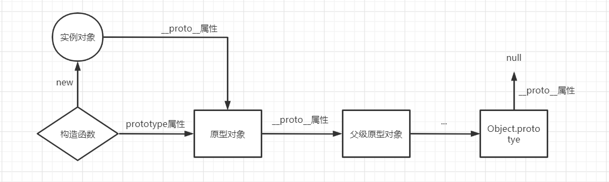
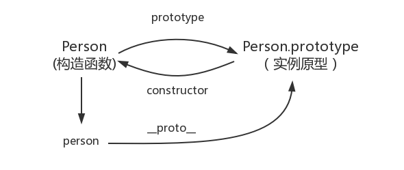
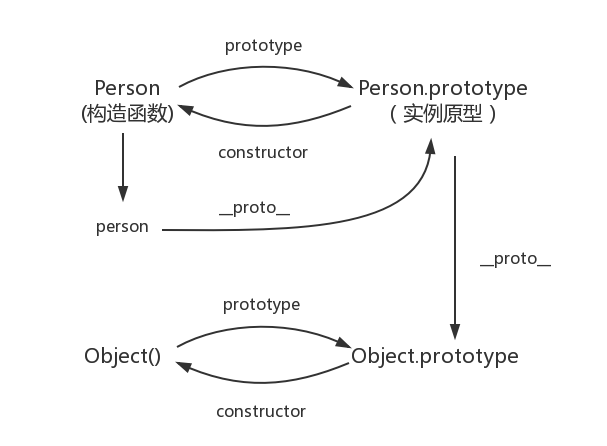
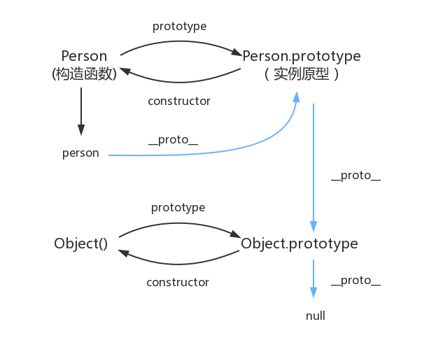

# 谈谈你对原型链的理解

## 1.原型对象和构造函数的关系

在 JavaScript 中，每当定义一个函数数据类型(普通函数、类)时候，都会天生自带一个 prototype 属性，这个属性指向函数的原型对象

当函数经过 new 调用时，这个函数就成为了构造函数，返回一个全新的实例对象，这个实例对象有一个`__proto__`属性，指向构造函数的原型对象。


## 2.能不能描述一下原型链

JavaScript 对象通过 prototype 指向父类对象，直到指向 Object 对象为止，这样就形成了一个原型指向的链条, 即原型链。



- 对象的 hasOwnProperty() 来检查对象自身中是否含有该属性
- 使用 in 检查对象中是否含有某个属性时，如果对象中没有但是原型链中有，也会返回 true

## 3.constructor

constructor，每个原型都有一个 constructor 属性指向关联的构造函数。

```js
function Person() {}

console.log(Person === Person.prototype.constructor); //true
```



```js
function Person() {}

var person = new Person();

console.log(person.__proto__ == Person.prototype); //true

console.log(Person.prototype.constructor == Person); //true
//顺便学习一个ES5的方法,可以获得对象的原型
console.log(Object.getPrototypeOf(person) === Person.prototype); // true
```

## 4.实例与原型

当读取实例的属性时，如果找不到，就会查找与对象关联的原型中的属性，如果还查不到，就去找原型的原型，一直找到最顶层为止

举个栗子：

```js
function Person() {}

Person.prototype.name = "Kevin";

var person = new Person();

person.name = "Daisy";
console.log(person.name); // Daisy

delete person.name;
console.log(person.name); // Kevin
```

在这个例子中，我们给实例对象 person 添加了 name 属性，当我们打印 person.name 的时候，结果自然为 Daisy。

但是当我们删除了 person 的 name 属性时，读取 person.name，从 person 对象中找不到 name 属性就会从 person 的原型也就是 person.`__proto__` ，也就是 Person.prototype 中查找，幸运的是我们找到了 name 属性，结果为 Kevin。

但是万一还没有找到呢？原型的原型又是什么呢？

## 5.原型的原型

在前面，我们已经讲了原型也是一个对象，既然是对象，我们就可以用最原始的方式创建它，那就是：

```js
var obj = new Object();
obj.name = "Kevin";
console.log(obj.name); // Kevin
```

其实原型对象就是通过 Object 构造函数生成的，结合之前所讲，实例的 `__proto__` 指向构造函数的 prototype ，所以我们再更新下关系图：



## 6.原型链

那 Object.prototype 的原型呢？

null，我们可以打印：

```js
console.log(Object.prototype.__proto__ === null); // true
```

然而 null 究竟代表了什么呢？

> null 表示“没有对象”，即该处不应该有值

所以 Object.prototype.`__proto__` 的值为 null 跟 Object.prototype 没有原型，其实表达了一个意思。

所以查找属性的时候查到 Object.prototype 就可以停止查找了。

最后一张关系图也可以更新为：



顺便还要说一下，图中由相互关联的原型组成的链状结构就是原型链，也就是蓝色的这条线。

## 补充

### constructor

首先是 constructor 属性，我们看个例子：

```JS
function Person() {

}
var person = new Person();
console.log(person.constructor === Person); // true
```

当获取 person.constructor 时，其实 person 中并没有 constructor 属性,当不能读取到 constructor 属性时，会从 person 的原型也就是 Person.prototype 中读取，正好原型中有该属性，所以：

```js
person.constructor === Person.prototype.constructor;
```

### `__proto__`

其次是 `__proto__` ，绝大部分浏览器都支持这个非标准的方法访问原型，然而它并不存在于 Person.prototype 中，实际上，它是来自于 Object.prototype ，与其说是一个属性，不如说是一个 getter/setter，当使用 `obj.__proto__` 时，可以理解成返回了 `Object.getPrototypeOf(obj)`。
