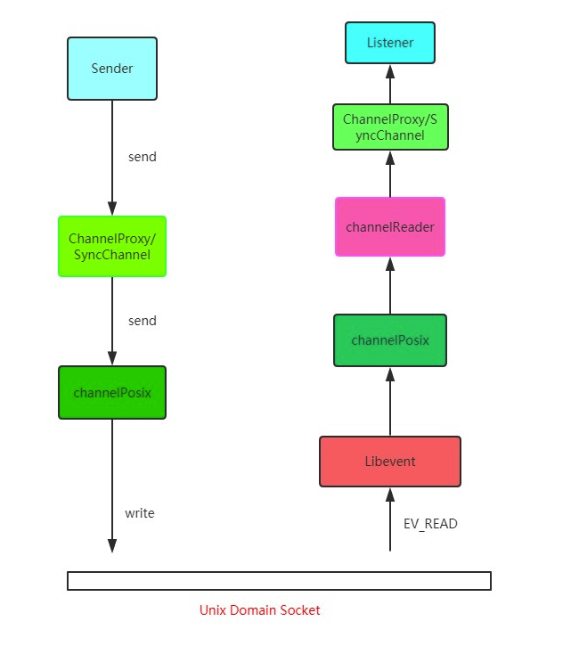

# 014：什么是跨域？浏览器如何拦截响应？如何解决

在前后端分离的开发模式下，经常会遇到跨域问题，即Ajax请求发出去了，服务器成功响应，前端就是拿不到这个响应。

## 什么是跨域

回顾一下 URL 的组成：


浏览器遵循**同源策略**（`scheme（协议`）、`host（主机`）和`port（端口`）都相同则为`同源`）。非同源站点有这样一些限制：

- 不能读取和修改对方的DOM
- 不能读取访问对方的`Cookie`、`indexDB`和`LocalStorage`
- 限制`XMLHttpRequest`请求

当浏览器像目标URL发Ajax请求时，只要当前URL和URL不同源，则产生跨域，被称之为**跨域请求**。

跨域请求的响应一般会被浏览器拦截，注意，是被浏览器拦截，响应其实是成功到达客户端了。那这个拦截时如何发生的呢？

首先要知道的是，浏览器是多进程的，一chrome为例，进程组成如下：


**WebKit渲染引擎**和**V8引擎**在渲染进程当中。

当 `xhr.send` 被系统调用，即Ajax请求准备发送的时候，其实还只是在渲染进程的处理。为了防止黑客通过脚本触碰到系统资源，浏览器将每个渲染进程装进了沙箱，并且为例防止CPU芯片一直存在的**Spectre**和**Meltdown**漏洞，采取了`站点隔离`的手段，给每一个不同的站点（一级域名不用）分配了沙箱，互不干扰。

在沙箱当中的渲染进程没有办法发送网络请求，那怎么办呢? 只能通过网络进程来发送。那这样就涉到了进程间通信（IPC，Inter Process Communication）了。接下来我们看看chromium当中进程间通信是如何完成的，在chromium源码中调用顺序如下：



总的来说就是利用 `Unix Domain Socket` 套接字，配合事件驱动的高效性能网络并发库`libevent`完成进程的IPC过程。

好，现在数据传递给了浏览器主进程，主进程收到后，才真正的发出相应的网络请求。

在服务端处理完成数据后，紧响应放回，主进程检查到跨域，且没有cors响应头，将响应体全部丢掉，并不会发送给渲染进程。这就达到了拦截数据的目的。

接下来说说解决跨域问题的方案。

## CORS

CORS 其实就是W3C的一个标准，全称`跨域资源共享`。他需要浏览器和服务器的共同支持，具体来说，非IE和IE10及以上支持CORS，服务器需要附加特定的响应头，不过在弄清楚CORS的原理之前，我们需要先了解连个概念：**简单请求**和**非简单请求**。

浏览器根据请求方法和请求头的特定字段，将请求做了分类，具体来说规则是这样，凡是满足一下条件的属于**简单请求**：

- 请求方式为`GET`、`POST` 或者 `HEAD`
- 请求头的取值范围：`Accept`、`Accept-Language`、`Content-Type`(只限于三个值 `application/x-www-form-urlencoded`、`multipart/form-data`、`text/plain`)

浏览器画了这样一个圈，在这个圈里面的请求就是**简单请求**，圈外面就是**非简单请求**，然后针对这两种不同的请求进行不同的处理。

### 简单请求

请求发出去之前，浏览器做了什么？

它会自动在请求头当中，添加一个Origin字段，用来说明请求来自那个`源`。服务器拿到请求之后，在回应时添加`Access-Control-Allow-Origin`字段，如果`Origin`不在这个字段的范围，那么浏览器就会将相应拦截。

因此，`Access-Control-Allow-Origin` 字段是服务器用来解决浏览器是否拦截这个相应，这是必须的字段。与此同时，其它一些可选的功能性字段，用来描述如果不会拦截，这些自动卷会发挥各自的作用。

**Access-Control-Allow-Credentials**。这个字段是一个布尔值，表示是否允许发送`Cookie`，对于跨域请求，浏览器对这个字段默认为`false`，而如果需要拿到浏览器的`Cookie`，需要添加这个相应头并且设为`true`，并且在前端也需要设置`withCredentials`属性：

```js
let xhr = new XMLHttpRequest();
xhr.withCredentials = true;
```

**Access-Control-Allow-Headers**。这个字段是给`XMLHttpRequest`对象赋能，让它不仅可以拿到基本的6个响应头（包括`Cache-Control`、`Content-Language`、`Content-Type`、`Expires`、`Last-Modified`和`Pragma`），还能难道这个字段声明的响应头字段，比如这样设置：

```js
Access-Control-Expose-Headers: aaa
```

那么在前端可以通过 `XMLHttpRequest.getResponseHeader('aaa')` 拿到 `aaa` 这个字段的值。
