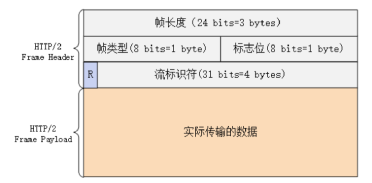
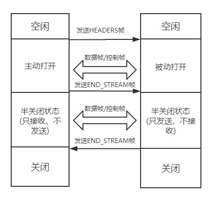

# 018:HTTP/2中的二进制帧是如何设计的？

## 帧结构

HTTP/2中传输的帧结构如下图所示：

每个帧分为`帧头`和`帧体`。先是三个字节的帧长度，这个长度表示的是`帧体`的长度。

然后是帧类型，大概可以分为*数据帧*和*控制帧*两种。数据帧用来存放 HTTP 报文，控制帧用来管理流的传输。

接下来的一个字节是**帧标志**，里面一共有 8 个标志位，常用的有 **END_HEADERS**表示头数据结束，**END_STREAM**表示单方向数据发送结束。

后 4 个字节是`Stream ID`, 也就是`流标识符`，有了它，接收方就能从乱序的二进制帧中选择出 ID 相同的帧，按顺序组装成请求/响应报文。

## 流的状态变化

从前面可以知道，在 HTTP/2 中，所谓的`流`，其实就是二进制帧的**双向传输的序列**。那么在 HTTP/2 请求和响应的过程中，流的状态是如何变化的呢？

HTTP/2 其实也是借鉴了 TCP 状态变化的思想，根据帧的标志位来实现具体的状态改变。这里我们以一个普通的`请求-响应`过程为例来说明：

最开始两者都是空闲状态，当客户端发送`Headers`帧后，开始分配`Stream ID`, 此时客户端的流打开, 服务端接收之后服务端的`流`也打开，两端的`流`都打开之后，就可以互相传递数据帧和控制帧了。

当客户端要关闭时，向服务端发送END_STREAM帧，进入`半关闭状态`, 这个时候客户端只能接收数据，而不能发送数据。

服务端收到这个`END_STREAM`帧后也进入`半关闭状态`，不过此时服务端的情况是只能发送数据，而不能接收数据。随后服务端也向客户端发送`END_STREAM`帧，表示数据发送完毕，双方进入`关闭状态`。

如果下次要开启新的`流`，流 ID 需要自增，直到上限为止，到达上限后开一个新的 TCP 连接重头开始计数。由于流 ID 字段长度为 4 个字节，最高位又被保留，因此范围是 0 ~ 2的 31 次方，大约 21 亿个。

## 流的特性

刚刚谈到了流的状态变化过程，这里顺便就来总结一下`流`传输的特性:

- 并发性。一个 HTTP/2 连接上可以同时发多个帧，这一点和 HTTP/1 不同。这也是实现**多路复用**的基础。
- 自增性。流 ID 是不可重用的，而是会按顺序递增，达到上限之后又新开 TCP 连接从头开始。
- 双向性。客户端和服务端都可以创建流，互不干扰，双方都可以作为`发送方`或者`接收方`。
- 可设置优先级。可以设置数据帧的优先级，让服务端先处理重要资源，优化用户体验。
