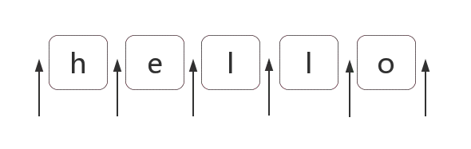

# 第一章 正则表达式字符匹配

正则表达式是匹配模式，要么匹配字符，要么匹配位置。

然而关于正则如何匹配字符的学习，大部分人都是觉得这块杂而乱。

内容包括：

1. 两种模糊匹配
2. 字符组
3. 变量
4. 分支结构
5. 案例分析

## 1.两种模糊匹配

如果正则只有精准匹配是没有多大意义的，比如 `/hello/`， 也只能匹配字符串中的“hello”这个字串。

```js
var regex = /hello/;
console.log(regex.text('hello'));
// => true
```

正则表达式之所以强大，就是因为其能实现模糊匹配。

而模糊匹配，只有两个方向上的模糊，横向模糊 和纵向模糊。

### 1.1横向模糊

横向模糊指的是，一个正则可匹配的字符串的长度是不固定的，可以是多种情况。

其实现的方式是使用量词。譬如{m, n}，表示连续出现最少m次，最多n次。

比如`/ab{2,5}c/`表示匹配这样的字符串：第一个字符是'a'，接下来是2到5个字符串‘b’，最有是字符串‘c’，测试如下：

```js
var regex = /ab{2,5}c/;
var string = "abc abbc abbbc abbbbc abbbbbc abbbbbbc";
console.log(string.match(regex));
// => ["abbc", "abbbc", "abbbbc", "abbbbbc"]
```

> 注意：案例中的正则/ab{2,5}c/g， 后面多了个g，它是正则里的 修饰符。表示全局匹配，即在目标字符串中按顺序找到满足匹配模式的所有字符串，强调的是“所有”，而不是一个。g的单词是global的首字母。

### 1.2 纵向模糊匹配

纵向模糊指的是，一个匹配的字符串，具体到某一位字符时，他可以不是某个确定的字符。可以有多种可能。

其实实现的方法是使用字符组，譬如`[abc]`,表示该字符是可以字符“a”、“b”、“c”中的任何一个。

比如：`/a[123]b/`可以匹配如下三种字符串：
"a1b", "a2b", "a3b" 测试如下：

```js
var regex = /a[123]b/g;
var string = 'a0b a1b a2b a3b a4b';
console.log(string.match(regex))
// => ["a1b", "a2b", "a3b"]
```

## 2. 字符组

需要强调的是，虽然叫字符组（字符类），但只是其中一个字符。例如`[abc]`，表示匹配一个字符，他可以是a，b，c之一。

### 2.1 范围表示法

如果字符组里的字符特别多的话，怎么办？可以使用范围表示法。

比如`[123456aabcdefGHJKLM]`，可以写成`[1-6a-fG_M]`。用连字符 - 来省略和简写

应为连字符有特殊用途，那么要匹配“a”、“-”、“z”这三者中任意一个字符，该怎么做？

可以写成如下形式：`[-az]`或者`[az-]`或者`[a\-z]`。即要么放在开头，要么放在结尾，要么转义。总之不会让引擎认为是范围表示法就行。

### 2.2排除字符组

纵向模糊匹配，还有一种情况就是，某位字符可以说任何东西，但就不能是“a”、“b”、“c”。

此时就是排除字符组（反义字符组）的概念。例如`[^abc]`，表示是一个除了“a”、“b”、“c”之外的任意一个字符。字符组的第一位放`^`(脱字符)，表示求反的概念。

当然，也有相应的范围表示法。

### 2.3 常见的简写形式

有了字符组的概念，一些常见的字符我们也就理解了。因为他们都是系统自带的简写形式。

- `\d`就是`[0-9]`。表示是一位数字，记忆方式： 其英文是digit（数字）。
- `-D`就是`[^0-9]`。表示除了数字的任何字符。
- `-w`就是`[0-9a-zA-Z_]`。表示数字、大小写字母和下划线。记忆方式：w是word的简写，也称单词简写。
- `-W`就是`[^0=9a-zA-Z_]`。表示非单词字符。
- `\s`就是`[\t\v\n\r\f]`。表示空白符，包括空格、水平制表符、垂直制表符、换行符、回撤符、换页符。记忆方式：s是space character的首字母。
- `S`就是`[^ \t\v\n\r\f]`。非空字符。
- `.`就是`[^\n\r\u2028\u2029]`。通配符，表示几乎任意字符。换行符、回车符、分行符、段分隔符除外。记忆方式：想想省略号……中的点，都可以理解成占位符，表示任何类似的东西。

如果要匹配任意字符怎么办？可以使用：
`[\d\D]`、`[\w\W]`、`[\s\S]`、`[^]`中的任何一个。

## 3.量词

量词也称重复。掌握`{m, n}`的准确含义后，只需要记住一些简单形式。

### 3.1简写形式

> `{m,}` 表示至少出现m次 \
> `{m}` 等价于`{m,n}`，表示出现m次 \
> `?` 等价于 `{0, 1}`，表示出现或者不出现。记忆方式：问好的意思表示，有吗？ \
> `+` 等价于`{1, }` 表示出现至少1次，记忆方式：加号是追加的意思，得先有1个，然后才能考虑追加。 \
> `*` 等价于 `{0, }` 表示出现任意次，有可能不出现。记忆方式：看看天上的星星✨，有可能一颗都没有，也可能零散几颗，也可能数不过来。

### 3.2贪婪匹配和惰性匹配

看如下例子：

```js
var regex = /\d{2,5}/g;
var string = "123 1234 12345 123456";
console.log(string.match(regex));
// => [ '123', '1234', '12345', '12345' ]
```

其中正则`/\{2,5}/` ,表示数字连续出现2到5次。会匹配2位、3位、4位、5位连续的数字。

但是其是贪婪的，它会尽可能多的匹配。你能给我6个，我就要5个。你能给我3个，我就要3个。反正只要在能力范围内，越多越好。

我们知道有时贪婪不是一件好事（请看文章最后一个例子）。而惰性匹配，就是经可能少的匹配：

```js
var regex = /\d{2,5}?/g;
var string = "123 1234 12345 123456";
console.log(string.match(regex));
// => [
//  '12', '12', '34',
//  '12', '34', '12',
//  '34', '56'
// ]
```

其中`/\{2, 5}?/g`, 表示，虽然2到5次都行，当2个就够了的时候，就不往下尝试了。

通过在量词的后面加个问好就能实现惰性匹配，因此所有的惰性匹配情形如下：

> `{m, n}?` \
> `{m, }?` \
> `??` \
> `+?` \
> `*?`

惰性匹配的记忆方式：量词后面加了个问好❓，问一问你知足了吗，你很贪婪吗？

## 4.多选分支

一个模式可以实现横向和纵向模糊匹配。而多选分支可以支持多个子模式任选其一。

具体形式如下：`(p1|p2|p3)`，其中`p1`、`p2`和`p3`是子模式，用`|`（管道符）分隔，表示任选其一。

例如要匹配“good”和“nice”可以使用`/good|nice/`。测试如下：

```js
var regex = /good|nice/g;
var string = "good idea, nice try.";
console.log(string.match(regex));
// => ["good", "nice"]
```

但有个事实我们应该注意，比如我用 `/good|nice/` ,去匹配“goodbye”字符串时，结果为“good”：

```js
var regex = /good|nice/g;
var string = "goodbye";
console.log(string.match(regex));
// => ["good"]
```

而把正则改为`/goodbye|good/`,结果为：

```js
var regex = /goodbye|good/g;
var string = "good idea, nice try.";
console.log(string.match(regex));
// => ["goodbye"]
```

也就是说，分支结构也是惰性的，即当前面的匹配上了，后面的就不再尝试了。

## 5.案例分析

匹配字符，无非就是字符组、量词和分支结构的组合使用罢了。

下面找几个案例演练一下子（其中，每个正则并不是只有唯一写法）：

### 5.1匹配16进制颜色值

要求匹配：

> #ffbbad \
> #Fc01DF \
> #FFF \
> ffE

分析：

表示一个16进制字符，可以用字符组`[0-9a-fA-F]`。

其中字符可以出现3或者6次，需要用量词和分支结构。

使用分支结构时，需要注意顺序。

正则如下：

```js
var regex = /#([0-9a-fA-F]{6}|[0-9a-fA-F]{3})/g;
var string = "#ffbbad #Fc01DF #FFF #ffE";
console.log(string.match(regex));
// => ["#ffbbad", "#Fc01DF", "#FFF", "#ffE"]
```

### 5.2匹配时间

以24小时制为例。

要求匹配：

> 23:59\
> 02:07

分析：

共4位数字，第一位数字可以为`[0-2]`

当第一位2时，第二位可以位`[0-3]`，其他情况时，第2位为`[0-9]`

第三位数字为`[0-5]`,第四位为`[0-9]`

正则如下：

```js
var regex = /^([01][0-9]|[2][0-3]):[0-5][0-9]$/;
console.log(regex.text("23:59"));
console.log(regex.text("02:07"));
// => true
// => true
```

如果也要求匹配7:9，也就是说时分前面的0可以省略。

正则变成如下：

```js
var regex = /^(0?[0-9]|1[0-9]|[2][0-3]):(0?[0-9]|[1-5][0-9])$/;
console.log(regex.test("23:59"));
console.log(regex.test("02:04"));
console.log(regex.test("7:9"));
// => true
// => true
// => true
```

### 5.3匹配日期

比如yyyy-mm-dd格式为例。

要求匹配：

> 2020-06-14

分析：

年，四位数字即可，可用的`[0-9]{4}`

月，共12月，分两种情况01、02、……、09、10、11和12，可用`(0[1-9]|1[0-2])`

日，最大31天，可用`(0[1-9]|[12][0-9]|3[01])`

正则如下：

```js
var regex = /^[0-9]{4}-(0[1-9]|1[0-2])-(0[0-9]|[12][0-9]|3[01])$/;
console.log(regex.test("2020-06-14"))
// => true
```

### 5.4window操作系统文件路径

要求匹配：

> F:\study\javascript\regex\regular expression.pdf
> F:\study\javascript\regex\ \
> F:\study\javascript \
> F:\

分析：

整体模式是：盘符:\文件夹\文件夹\文件夹\

其中匹配F:\，需要使用`[a-zA-Z]:\\`，其中盘符不区分大小写，注意`\`字符需要转义。

文件或者文件夹名，不能包含一些特殊字符，此时我们需要排除特殊字符组`[^\\:*<>|"?\r\n/]`来表示合法字符。另外不能为空名，至少一个字符，也就是使用量词`+`。因此匹配“文件夹\”,可用`[^\\:*<>|"?\r\n/]+\\`。

另外"文件夹\"，可以出现任意次。也即是`([^\\:*<>|"?\r\n/]+\\)*`。其中括号提供子表达式。

路径的最后一部分就是子文件夹，没有`\`，因此需要添加 `([^\\:*<>|"?\r\n/]+)?`。

最后拼接成了一个看起来比较复杂的正则：

```js
var regex = /^[a-zA-Z]:\\([^\\:*<>|"?\r\n/]+\\)*([^\\:*<>|"?\r\n/]+)?$/;
console.log(regex.test("F:\\study\\javascript\\regex\\regular expression.pdf"));
console.log(regex.test("F:\\study\\javascript\\regex\\"));
console.log(regex.test("F:\\study\\javascript"));
console.log(regex.test("F:\\"));
// => true
// => true
// => true
// => true
```

其中，JS中字符串表示`\`时，也要转义。

### 5.5匹配id

要求从

> `<div id="container" class="main"></div>`

提取出id=“container”。

可能最开始想到的正则：

```js
var regex = /id=".*"/;
var string = '<div id="container" class="main"></div>';
console.log(string.match(regex)[0]);
// => id="container" class="main"
```

因为`.`是通配符，本身就是匹配双引号的，而量词`*`又是贪婪匹配的，当遇到contaienr后面的双引号时，不会停下来，会继续匹配，直到遇到最后一个双引号为止。

解决之道，可以使用惰性匹配：

```js
var regex = /id=".*?"/;
var string = '<div id="container" class="main"></div>';
console.log(string.match(regex)[0]);
// => id="container"
```

当然，这样也会有问题。效率比价低，因为其匹配原理会涉及到“回溯”这个该概念。优化如下：

```js
var regex = /id="[^"]"/;
var string = '<div id="container" class="main"></div>';
console.log(string.match(regex)[0]);
// => id="container"
```

## 第一章小结

字符匹配相关案例，挺多的。

掌握字符组和量词就能解决大部分常见问题，也就是说，当你会了这二者，JS正则算是入门了。

# 第二章 正则表达式位置匹配

正则表达式是匹配模式，要么匹配字符，要么匹配位置。一定记住这句话。

然而大部人在学习正则时，对匹配位置的重视度没有那么高。

本章学习正则位置匹配的总总。

内容包括：

  1. 什么是位置？
  
  2. 如何匹配位置？

  3. 位置的特征
  
  4. 几个应用实例分析
   
## 1.什么是位置呢？

位置是相邻字符之间的位置，比如，下图中箭头所指的地方：



## 2. 如何匹配位置呢？

在ES5中，共有6个锚字符：

> `^`  \
> `$` \
> `\b` \
> `\B` \
> `(?=p)` \
> `(?!p)`

### 2.1 `^` 和 `$`

`^`（脱字符）匹配开头，在多行匹配中匹配行开头。

`$` （美元字符）撇配结尾，在多行匹配中匹配结尾。

比如我们把字符的开头和结尾用 "#" 替换（位置可以替换为字符的！）：

```js
var result = "hello".replace(/^|$/g, "#");
console.log(result);
// => "#hello#"
```

多行匹配模式时，二者是行的概念，这个需要我们注意：

```js
var result = "I\nlove\njavascript".replace(/^|$/gm, '#');
console.log(result);
/*
#I#
#love#
#javascript#
*/
```

### 2.2`\b` 和 `\B`

`\b`是单词边界，具体就是`\w`和`\W`之间的位置，也包括`\w`和`^`之间的位置，也包括`\w`和`\$`之间的位置。

比如一个文件名是"[JS]Lesson_o1.pm4"中的`\b`，如下：

```js
var result = "[JS]Lesson_o1.pm4".replace(/\b/g, "#");
console.log(result);
// => [#JS#]#Lesson_o1#.#pm4#
```

为什么是这样呢？这需要仔细看看。

首先，我么知道，`\w`是字符组`[0-9a-zA-Z_]`的简写，即`\w`是字母数字或者下划线的中任何一个字符。而`\W`是排除字符组`[^0-9a-zA-Z_]`的简写形式，即`\W`是`\w`以外的任何一个字符。

此时我们可以开看看"[#JS#] #Lesson_01#.#mp4#"中的每一个"#"，是怎么来的。

- 第一个"#"，两边是"["与"J"，是`\W`和`\w`之间的位置。
- 第二个"#"，两边是"S"与"]"，也就是`\w`和`\W`之间的位置。
- 第三个"#"，两边是空格与"L"，也就是`\W`和`\w`之间的位置。
- 第四个"#"，两边是"1"与"."，也就是`\w`和`\W`之间的位置。
- 第五个"#"，两边是"."与"m"，也就是`\W`和`\w`之间的位置。
- 第六个"#"，其对应的位置是结尾，但其前面的字符"4"是`\w`，即`\w`和$之间的位置。

知道了`\b`的概念后，那么`\B`也就相对好理解了。

`\B`就是`\b`的反面的意思，非单词边界。例如在字符串中所有位置中，扣掉`\b`，剩下的都是`\B`的。

具体说来就是`\w`与`\w`、`\W`与`\W`、`^`与`\W`，`\W`与`$`之间的位置。

比如上面的例子，把所有`\B`替换成"#"：

```js
var result = "[JS] Lesson_01.mp4".replace(/\B/g, "#");
console.log(result);
// => "#[J#S]# L#e#s#s#o#n#_#0#1.m#p#4"
```

### 2.3 `(?=p)`和`(?!p)`

`(?=p)` ,其中`p`是一个子模式，即`p`前面的位置。

比如`(?=l)`，表示“l”字符前面的位置，例如：

```js
var result = "hello".replace(/(?!l)/g, "#");
console.log(result);
// => "#h#ell#o#"
```

二者的学名分别是positive lookahead和negative lookahead。

中文翻译分别是正向先行断言和负向先行断言。

ES6中，还支持positive lookbehind和negative lookbehind。

具体是`(?<=p)`和`(?<!p)`。也有书上把这四个东西，翻译成环视，即看看右边或看看左边。

但一般书上，没有很好强调这四者是个位置。

比如`(?=p)`，一般都理解成：要求接下来的字符与`p`匹配，但不能包括`p`的那些字符。

而在本人看来`(?=p)`就与^一样好理解，就是`p`前面的那个位置。

## 3. 位置特征

对于位置的理解，我们可以理解为空字符""。

比如"hello"字符串等价于如下表示：

```js
"hello" == "" + "h" + "" + "e" + "" + "l" + "" + "l" + "o" + "";
```

也等价于：

```js
"hello" == "" + "" + "hello"
```

因此，把`/^hellw$/``/^^hello$$$/`，是没有任何问题的：

```js
var result = /^^hello$$$/.test("hello");
console.log(result);
// => true
```

甚至可以写成更复杂的：

```js
var result = /(?=he)^^he(?=\w)llo$\b\b$/.test("hello");
console.log(result);
// => true
```

也就是说字符之间的位置，可以写成多个。

把位置理解为空字符串，是对位置非常有效的理解方式。

## 4. 相关案例

### 4.1 不匹配任何东西的正则

让你写的正则不匹配任何东西

easy，`/.^/`

因为此正则要求只有一个字符，但是该字符后面是开头。

### 4.2 数字的千位分隔符表示法

比如把"12345678"，变成"12,345,678"。

可见是需要把相应的位置替换成","。

思路是什么？

#### 4.2.1弄出一个逗号

使用`(?=d{3}$)`就可以做到：

```js
var result = "12345678".replace(/(?=\d{3}$)/g, ',');
console.log(result); 
// => "12345,678"
```

#### 4.2.2弄出所有的逗号

因为逗号出现的位置，要求后面3个数字一组，也就是`\d{3}`至少出现一次。

此时可以使用量词`+`：

```js
var result = "12345678".replace(/(?=(\d{3})+$)/g, ',')
console.log(result); 
// => "12,345,678"
```

#### 4.2.3 匹配其余案例

写完正则后，要多验证几个案例，此时我们会发现问题：

```js
var result = "123456789".replace(/(?=(\d{3})+$)/g, ',')
console.log(result); 
// => ",123,456,789"
```

因为上面的正则，仅仅表示把从结尾向前数，一但是3的倍数，就把其前面的位置替换成逗号。

因此才会出现这个问题。怎么解决呢？我们要求匹配的到这个位置不能是开头。

我们知道匹配开头可以使用`^`，但要求这个位置不是开头怎么办？

easy，`(?!^)`，你想到了吗？测试如下：

```js
var string1 = "12345678",
string2 = "123456789";
reg = /(?!^)(?=(\d{3})+$)/g;

var result = string1.replace(reg, ',')
console.log(result); 
// => "12,345,678"

result = string2.replace(reg, ',');
console.log(result); 
// => "123,456,789"
```

#### 4.2.4 支持其他形式

如果要把"12345678 123456789"替换成"12,345,678 123,456,789"。

此时我们需要修改正则，把里面的开头`^`和结尾`$`，替换成`\b`：

```js
var string = "12345678 123456789",
reg = /(?!\b)(?=(\d{3})+\b)/g;

var result = string.replace(reg, ',')
console.log(result); 
// => "12,345,678 123,456,789"
```

其中`(?!\b)`怎么理解呢？

要求当前是一个位置，但不是`\b`前面的位置，其实`(?!\b)`说的就是`\B`。

因此最终正则变成了：`/\B(?=(\d{3})+\b)/g`。

### 4.3 验证密码问题

密码长度6-12位，由数字、小写字符和大写字母组成，但必须至少包括2种字符。

此题，如果写成多个正则来判断，比较容易。但要写成一个正则就比较困难。

那么，我们就来挑战一下。看看我们对位置的理解是否深刻。

#### 4.3.1 简化

不考虑“但必须至少包括2种字符”这一条件。我们可以容易写出：

```js
var reg = /^[0-9A-Za-z]{6,12}$/;
```

#### 4.3.2 判断是否包含有某一种字符

假设，要求的必须包含数字，怎么办？此时我们可以使用`(?=.*[0-9])`来做。

因此正则变成：

```js
var reg = /(?=.*[0-9])^[0-9A-Za-z]{6,12}$/;
```

#### 4.3.4 解答

我们可以把原题变成下列几种情况之一：

  1. 同时包含数字和小写字母

  2. 同时包含数字和大写字母
     
  3. 同时包含小写字母和大写字母

  4. 同时包含数字、小写字母和大写字母

以上的4种情况是或的关系（实际上，可以不用第4条）。

最终答案是：

```js
var reg = /((?=.*[0-9])(?=.*[a-z])|(?=.*[0-9])(?=.*[A-Z])|(?=.*[a-z])(?=.*[A-Z]))^[0-9A-Za-z]{6,12}$/;
console.log( reg.test("1234567") ); // false 全是数字
console.log( reg.test("abcdef") ); // false 全是小写字母
console.log( reg.test("ABCDEFGH") ); // false 全是大写字母
console.log( reg.test("ab23C") ); // false 不足6位
console.log( reg.test("ABCDEF234") ); // true 大写字母和数字
console.log( reg.test("abcdEF234") ); // true 三者都有
```

#### 4.3.5 解惑

上面的正则看起来比较复杂，只要理解了第二步，其余就全部理解了。

`/(?=.*[0-9])^[0-9A-Za-z]{6,12}$/`

对于这个正则，我们只需要弄明白`(?=.*[0-9])^`即可。

分开来看就是`(?=.*[0-9])`和`^`。

表示开头前面还有个位置（当然也是开头，即同一个位置，想想之前的空字符类比）。

`(?=.*[0-9])`表示该位置后面的字符匹配`.*[0-9]`，即，有任何多个任意字符，后面再跟个数字。

翻译成大白话，就是接下来的字符，必须包含个数字。

#### 4.3.6 另外一种解法

“至少包含两种字符”的意思就是说，不能全部都是数字，也不能全部都是小写字母，也不能全部都是大写字母。

那么要求“不能全部都是数字”，怎么做呢？`(?!p)`出马！

对应的正则是：

```js
var reg = /(?!^[0-9]{6,12}$)^[0-9A-Za-z]{6,12}$/;
```

三种“都不能”呢？

最终答案是：

```js
var reg = /(?!^[0-9]{6,12}$)(?!^[a-z]{6,12}$)(?!^[A-Z]{6,12}$)^[0-9A-Za-z]{6,12}$/;
console.log( reg.test("1234567") ); // false 全是数字
console.log( reg.test("abcdef") ); // false 全是小写字母
console.log( reg.test("ABCDEFGH") ); // false 全是大写字母
console.log( reg.test("ab23C") ); // false 不足6位
console.log( reg.test("ABCDEF234") ); // true 大写字母和数字
console.log( reg.test("abcdEF234") ); // true 三者都有
```

## 第二章小结

位置匹配相关的案例，挺多的，不一而足。

掌握匹配位置的这6个锚字符，给我们解决正则问题一个新工具。
