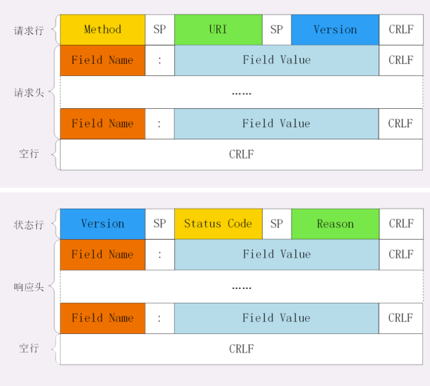

# 001. HTTP报文结构是怎样的？

对于 TCP 而言，在传输的时候分为两个部分：**TCP头**和**数据部分**。

而 HTTP 类似，也是 `header + body`的结构，具体而言：

```text
起始行 + 头部 + 空行 + 实体
```

由于 HTTP `请求报文` 和 `响应报文` 是有区别的，因此需要分开介绍。

## 起始行

对于请求报文来说，起始行类似下面的结构：

```js
GET /home HTTP/1.1
```

也就是 **方法 + 路径 + http版本**。

对于响应报文来说，起始行一般长这样：

```js
HTTP/1.1 200 OK
```

响应报文的起始行也叫做 `状态行` 。由 **http 版本、状态码和原因**三部分组成。

值得注意的是，在起始行中，每两部分之间用**空格**隔开，最后一部分后面应该接一个**换行**，严格遵循`ABNF`语法规范。

## 头部

展示一下请求头部和响应头在报文中的位置：



不管是请求头还是响应头，其中的字段是相当多的，而且牵扯到 `http` 非常多的特征，这里就不一一列举，重点看看这些头部字段的格式：

- 字段名不区分大小写
  
- 字段名不允许出现空格，不可以出现下划线 `_`
  
- 字段名后面必须 **紧挨者**`:`

## 空行

很重要，用于区分开 **头部** 和 **实例**。

问：如果说在头部中故意加一个空行会怎么样？

答：那么空行后的内容全部被视为实体。

## 实体

就是具体的数据了，也就是 `body` 部分。请求报文对应 `请求体`，响应报文对应 `响应体`。
