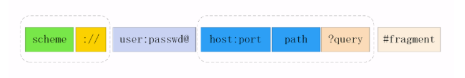

# 003.如何理解URL？

**URL**，全称（Uniform Resource Identifier），也就是 **统一资源标识符** ，它的作用很简单，就是区分互联网上的不同的资源。

但是，它并不是我们常说的 `网址` ，网址指的是 `URL`，实际上 `URI` 包含了 `URN` 和 `URL` 两部分，由于 URL 过于普及，就默认将 URI 视为 URL。

## URI的结构

URI 真正完整的机构是这样的：



可能你会有疑问，好像跟平时见到的不太一样啊！先别急，我们来一一拆解。

**scheme** 表示协议名，比如 `http, https, file` 等等。后面必须和 `://` 连在一起。

**user:passwd@** 表示登录主机时的用户信息，不过很不安全，不推荐使用，也不常用。

**host:port** 表示主机名和端口。

**path** 表示请求路径，标记资源所在位置。

**query** 表示查询参数，为 `key=val` 这种形式，多个键值对之间用&隔开。

**fragment** 表示 URI 所定位的资源内的一个**锚点**，浏览器可以根据这个锚点跳转到对应的位置。

举个例子:

```http
https://www.baidu.com/s?wd=HTTP&rsv_spt=1
```

这个 URI 中，`https` 即 `scheme` 部分，`www.baidu.com` 为 `host:port` 部分（注意，http 和 https 的默认端口分别为80、443），/s为 `path` 部分，而 `wd=HTTP&rsv_spt=1` 就是 `query` 部分。

## URI编码

URI 只能使用 `ASCII`, ASCII 之外的字符是不支持显示的，而且还有一部分符号是界定符，如果不加以处理就会导致解析出错。

因此，URI 引入了 `编码` 机制，将所有 `非 ASCII 码字符` 和 `界定符` 转为十六进制字节值，然后在前面加个`%`。

如，空格被转义成了`%20`，三元被转义成了`%E4%B8%89%E5%85%83`。
